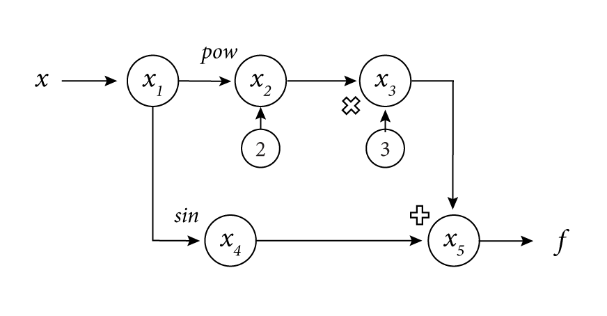
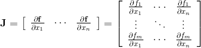
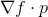

# AD-PYNE 

###### A(utomatic) D(ifferentiation) - (As developed by) P(aulina) Y(aowei) N(ikhil) E(mma)

December 10, 2019

# Introduction

Differentiation's use is ubiquitous across the sciences and is required for common methods such as optimization. Historically, there have existed two ways of computing derivatives: symbolic differentiation and method of finite differences. Both of these techniques have numerous drawbacks. Symbolic differentiation involves manipulating the abstract formula using mathematical expressions and rules to produce a desired derivative formula. This can be computationally expensive, and it does not address derivatives which are impossible to compute by hand, and have no "closed-form" solution. The method of finite differences can solve these issues, but in turn it requires a good choice of step size for the derivative to be evaluated accurately and in a stable manner. 

Automatic differentiation (AD) is the best of worlds: it is not as computationally expensive, it can address functions whose derivatives are impossible to compute by hand, and it is stable and accurate to machine precision. Additionally, it can be extended to not only first order derivatives, but also derivatives of any higher order. 

# Background

Automatic differentiation teaches the computer how to calculate derivatives on its own without relying on computationally expensive symbolic differentiation programs or on potentially unstable and inaccurate approximations with the finite-difference method. AD breaks down the task of calculating a derivative of any function into a series of more simple elementary operations such as addition, multiplication, powers, natural log, etc., whose derivatives we already know. We piece together these derivatives using the Chain Rule.

### Chain Rule

This breakdown is made possible by the Chain Rule, where F(x) is a composition of two or more functions.


In automatic differentiation, we treat a function as the composition of all of its elementary operations. Thus, the derivative of the original function is the result of using the Chain Rule to combine the derivatives of its constituents.   

### Computational Graph

The computational graph of the function allows us to see and record the progress of the Chain Rule at each step of composition. 

**Example function:**


**Example computational graph:**



In the graph above, we can see the input term on the left side. We break the function into nodes, each representing an elementary function performed on previous nodes. The computational graph gives us a visual understanding of how the function is being built up and how we are applying the Chain Rule to form the final derivative.

### Trace Table

The computational graph visualizes the trace table where each elementary function performed gets its own row of current inputs, values, the derivative of the elementary function (as determined by previous steps) and the value of the derivative of the elementary function evaluated at the current value. 

**Example trace table:**

| Trace         | Elementary Function           | Elementary Function Derivative   | Current Value           | ∇x          |
| ------------- | ----------------------------- | -------------------------------- | ----------------------- | ----------- |
| x<sub>1</sub> | x<sub>1</sub>                 | ẋ<sub>1</sub>                    | x                       | 1           |
| x<sub>2</sub> | x<sub>1</sub><sup>2</sup>     | 2x<sub>2</sub>ẋ<sub>1</sub>      | 2x                      | 2x          |
| x<sub>3</sub> | 3x<sub>2</sub>                | 3ẋ<sub>2</sub>                   | 3x<sup>2</sup>          | 6x          |
| x<sub>4</sub> | sin(x<sub>1</sub>)            | cos(x<sub>1</sub>) ẋ<sub>1</sub> | sin(x)                  | cos(x)      |
| x<sub>5</sub> | x<sub>3</sub> + x<sub>4</sub> | ẋ<sub>3</sub> + ẋ<sub>4</sub>    | 3x<sup>2</sup> + sin(x) | 6x + cos(x) |

Automatic Differentiation moves forward through this graph (but does not necessarily have to record all the rows) to calculate the derivative of the full function. The value of the derivative ẋ<sub>1</sub> is determined by a seed vector: a vector of derivative values initialized for the variables of interest. 

### The Jacobian

The trace table above shows us how to manually perform the forward mode of automatic differentiation for scalar functions of a single variable; however, during practical application we will need to be able to handle systems of equations (*f* as a vector), which will require differentiation of a vector function of multiple variables. An important element of this process is the Jacobian matrix, which contains the function’s partial derivatives.



We know from above that automatic differentiation computes the derivative as the dot product of the gradient and the seed vector, written as:



 Considering the Jacobian form, what forward mode really computes is . Beyond this, we can choose the value of the seed vectors {*p*<sub>1</sub>, ..., *p*<sub>*n*</sub>} where *p*<sub>i</sub> ∈  ℝ<sup>*n*</sup> to form the entirety or part of the Jacobian, depending on our applications.

### Dual Numbers 

Dual numbers are a mathematical construct that can serve as an alternative method of implementing automatic differentiation. Similar in format to complex numbers, they possess a real part and a “dual” part in the format of a + b * epsilon, where epsilon has the property that epsilon^2=0 (it is nilpotent, and not a real number). Dual numbers can be used to store and compute derivatives of functions. Because of the properties of epsilon, if its coefficient b is initialized as a derivative seed, any function involving the dual number will retain and have the derivative calculated. When dual numbers are substituted into a function and simplified into a dual number again (via Taylor series expansions), the real part becomes the original function, and the dual part becomes the derivative of that function. Thus, when elementary functions are performed on dual numbers, b remains the derivative of a. In particular, the addition, subtraction, multiplication, and division of dual numbers end up mimicking the chain rule used in automatic differentiation. 

Dual numbers can also be nested within each other to calculate higher order derivatives. It is this property that we will take advantage of in particular. 

An example of using dual numbers to calculate the first and second derivative:If we wanted to calculate the derivative of f(x)=x^2, at x=2, we can define a dual number (which we can treat as a variable) x = a + b * epsilon, where a=2 (the value we want to evaluate the function at) and b=1, the seed derivative (this is defining x’=1). We can then substitute the dual number into the function and expand: (a + b * epsilon)(a + b * epsilon) = a^2 + 2ab * epsilon + b^2 * epsilon^2, remember that through the properties of dual numbers, epsilon^2=0, so the last term can be cancelled out. Therefore, we are left with a new dual number: a^2 + (2ab) * epsilon. Therefore we conclude that the derivative, which is the dual part of the number 2ab=2(2)(1) = 4. We can verify this number from calculus theory.

To calculate the second derivative, instead of being the “real” value part of the number, we define it to be a dual number itself (thus nesting a dual inside a dual). Since the first derivative we found above was 2ab, we define a as a new dual number a = (c + d * epsilon), where c is the evaluation value again (2), and d is the seed (1). We now compute 2ab = 2*(c + d * epsilon) * b = 2bc + 2bd * epsilon. The “dual part” of this new number is 2bd = 2(1)(1) =2, which is the second derivative of x^2.

# How to Use AD-PYNE

## Installing

### Requirements

1. Ensure you can run Python from the command line. 
   - You can check this by running: `python --version`
2. Ensure you can run  pip form the command line. 
   - You can check this by running: `pip --version`

### Install the package

1. Set up a virtual environment

   - Create an environment with the command: `conda create --name env_name python`
   - Activating the environment: `conda activate env_name`
   - You can get out of the environment afterwards (deactivate it) by typing: `conda deactivate`

2. Install the package from PyPi and dependencies

   - Type  `pip install -i https://test.pypi.org/simple/ ADPYNE-207`
     
     
## Importing

```python
from ADPYNE.AutoDiff import AutoDiff, vectorize
import ADPYNE.elemFunctions as ef
from ADPYNE.Dual import Dual, vectorizeDual
```
### How To Guide

For the interactive how-to-guide on how to use Forward Mode for automatic differentiation and Dual Mode for higher order derivatives, please see the Jupyter Notebook *HowToGuide.ipynb* in the /docs folder. 

# Software Organization 

## Directory Structure 


	ADPYNE/
	
	    ADPYNE/
	
		__init__.py
	
		elemFunctions.py
	
		AutoDiff.py
		
		Dual.py
			   		
		tests/
	
		    elemFunctions_test.py
	
		    AutoDiff_test.py
	
		    Dual_test.py
		    
		docs/
	
		   milestone1.md
	
		   miilestone2.md
	
	   	   documentation.md
		
		   HowToGuide.ipynb
	
		README.md
	
		LICENSE
	
		setup.py
	
		requirements.txt


## Modules

###  elemFunctions

This module contains the hard-coded derivatives of the elementary functions such as sine, cosine, square root, log, exp, etc. Thus, we are creating our own custom elementary math functions using `numpy` math functions that can be performed on `AutoDiff` and `Dual` objects, and will return the respective objects. Duck typing will also allow the user to pass in either `AutoDiff`, `Dual`, or (vectors of) scalars and the correct type. It will import the `AutoDiff` and `Dual` classes from their respective modules. Users must import this module separately from the other modules in order to use these additional elementary functions.

### AutoDiff

This module contains the `AutoDiff` class that calculates the derivative and Jacobian of a scalar or vector function at given inputs and seed using the forward mode of automatic differentiation. The forward mode will automatically calculate the derivative and the Jacobian at each step of the function. The module overloads Python operations such as multiplication as well as some unary operations such as negation. (For a full list, see the **Forward Mode Implementation: Class** section below.) It contains a global function for creating vector functions using the `AutoDiff` class. 

The `AutoDiff` object works for the following cases:

- Scalar functions with single input of a scalar
- Scalar functions with single input of vectors
- Scalar functions with multiple inputs of scalars
- Scalar functions with multiple inputs of vectors
- Vector function with single input of a scalar
- Vector functions with single inputs of vectors
- Vector functions with multiple inputs of scalars
- Vector functions with multiple inputs of vectors

### Dual

This module contains the `Dual` class that holds a dual number. It can be used to calculate the derivative of scalar or vector functions. It is to be used to calculate and access higher order derivatives (of any order for single variable inputs and of the second order for multiple variable inputs). The module overloads Python operations such as multiplication as well as some unary operations such as negation. It contains a global function for creating vector functions using dual numbers. 


## Test Suite

The test suite lives in the `tests/` folder. Each module has its own test suite. The elementary functions test suite tests its use with both `AutoDiff` and `Dual` objects. 

We will be using `TravisCI` to ensure that all tests pass. We will be using `CodeCov` to ensure that all code is covered by a test. 


## Distribution

Distribution will be done through `PyPI` and `twine` will be used to upload the distribution package.


## Packaging 

Software packaging will be done without a framework and through Python's native distribution tools. Our target audience is a developer (or developer-student) audience. We are only packaging a library that will be used solely within Python by users who are assumed to know how to install and use Python packages. It is not a full fledged application like a web application nor is it its own executable software. The software organization is minimal and can be handled manually. 

# Implementation Details: Forward Mode 

Our forward mode implementation requires that the user pass in the following information when instantiating their `AutoDiff` objects:

* The scalar value or vector of values to be evaluated
* The scalar seed for the single value or a seed vector for the vector of values. This will be used to evaluate the derivative.
* The total number of inputs *n* that will be used in the final function(s)
* The index of the variable used in the`AutoDiff`. That is, the user will provide some value *k* that denotes that the `AutoDiff` refers to the *k*<sup>th</sup> input variable in a vector of 1 to *n* total variables.

The forward mode will automatically calculate the derivative and the Jacobian at each step of the function. 

## Core Data Structures

The core data structures are:

* `numpy` arrays: We will be treating all values and arguments as array. 
  * A single variable, integer, or float will be treated as a 1 x 1 `numpy` array. This is done so that we don't have to deal with single values separately from vectors. 
  * Lists will be converted to 1 x n `numpy` arrays.
  * Users will not be allowed to pass in dictionaries to set their values. The evaluated output and derivative of the `AutoDiff` object will stored in their respective attributes and not in a general `params` attribute that holds a dictionary in the form `{'val': [], 'der': [] }`.

## Classes: Methods, and Name Attributes 

### AutoDiff

* Methods
  * \* `_convertNonArray` is a helper function that converts passed in scalar values to `numpy` arrays. This function is "private" and never needs to be called by the user. 
  
  * `_calcJacobian` is a helper function that calculates the Jacobian of the `AutoDiff` object when it is first instantiated by the user. It considers how many multiple inputs will ultimately be used in the final function(s) and the specific input of the `AutoDiff` object. This function is "private" and never needs to be called by the user.   
  
    * **Example:** The user wants to build a function with two different inputs, `x` and `y`. The user will create an `AutoDiff` object for `x` by passing in the total number of inputs as `2` and pass in `1` as the "index" for `x`. `_calcJacobian` will then create the Jacobian treating `x` as the first partial derivative. 
  
  * `_calcDerivative` is a helper function that converts the passed in derivative value to numpy array with the proper shape.
  
    
  
  * Overloaded Python operations:
    * `__add__`
    * `__radd__`
    * `__sub__`
    * `__rsub__`
    * `__mul__`
    * `__rmul__`
    * `__truediv__`
    * `__rtruediv__`
    * `__pow__`
    * `__rpow__`
    * `__pos__`
    * `__neg__`
    * `__abs__`
    *  `__eq__`  
    *  `__ne__`
* Attributes
  * `val` is the value of the function.
  * `der`is the value of the derivative of the function.
  * `jacobian` is the Jacobian of the partial derivatives
  * `n` is the total number of inputs to be used in the final function(s)
  * `k`denotes that the `AutoDiff` object refers to the *k*<sup>th</sup> input variable in a vector of 1 to *n* variables
  
  

## Functions

`AutoDiff` contains a function `vectorize` that takes in multiple functions built up with `AutoDiff` objects and returns an `AutoDiff` object of a vector function with the full matrices of calculated values, derivatives, and the jacobian. It allows users to perform operations all at once on the vector function. 


## External Dependencies

### numpy

`numpy` will be used to handle vector operations and math functions such as `sqrt`. 

### pytest

`pytest` will be used to handle tests.  


## Elementary Functions

Native Python elementary functions such as addition, multiplication, and power will be dealt with by overloading the operations in the `AutoDiff.py` operations. 

Elementary functions not native to Python will be dealt with in a specific module called `elemFunctions.py` which will hold Python functions that return the hard-coded derivative the elementary function. Functions will include many of those defined in `numpy`:

* `sin`
* `cos`
* `tan`
* `arcsin`
* `arccos`
* `arctan`
* `sinh`
* `cosh`
* `tanh`
* `arcsinh`
* `arccosh`
* `arctanh`
* `sqrt`
* `exp` (natural)
* `log`
* `log10`
* `log` of any base
* `logistic`

# Extension: Dual Numbers

## Implementation Details: Dual Mode Implementation

Our extension requires that the user pass in the following information when instantiating their `Dual` objects:

- The scalar value or vector of values to be evaluated
- The scalar seed for the single value or a seed vector for the vector of values.

The user may opt to only pass the scalar value or vector of values to be evaluated. If they do, the seed will default to 1. 

Evaluations of higher order derivatives are made possible by the following steps:

1. The user instantiates a `Dual` object.
2. The user builds a higher order `Dual` object(s) based on the object in the step above.
3. The user builds a function(s) (i.e. another `Dual` object) using the higher order `Dual` objects. 
4. The user calls a class method to calculate and store the higher order derivatives within the function `Dual` object’s `coefficients` attribute. 

For more information for how each step is implemented, see the class methods below. 

## Core Data Structures

The core data structures are:

- `numpy` arrays: We will be treating all vector values and a rguments for `AutoDiff` as arrays. 
  - Lists will *not* be converted to 1 x n `numpy` arrays. Users must pass vectors as numpy arrays.  
  - Users will not be allowed to pass in dictionaries to set their values. The evaluated output and derivative of the `AutoDiff` object will stored in their respective attributes and not in a general `params` attribute that holds a dictionary in the form `{'val': [], 'der': [] }`.

## Classes: Methods and Name Attributes 

### Dual

- Methods 
  -  `makeHighestOrder` is a function that creates nested `Dual` objects using the recursive helper function `_createNestedduals`. The user passes in the highest order for which it would like to evaluate derivaties. It returns a single `Dual` object with the nested `Dual` objects as its `.Real` and `.Dual` attributes. For example, if a user calls the method for order 2, this function returns a `Dual` object where `.Real` is a `Dual` object and `.Dual` is a number.  
  -  `_createNestedduals` is a helper function within `makeHighestOrder` that uses recursion to nest `Dual` objects within each other.  
  -  `buildCoefficients` is a function that calculates and stores the higher order derivatives as a list for scalar functions and an array for vector functions, within the object’s attribute `coefficients`.

-  Overloaded Python operations:  
  -  `__str__`  
  -  `__add__`  
  -  `__radd__`  
  -  `__sub__`  
  -  `__rsub__`  
  -  `__mul__`  
  -  `__rmul__`  
  -  `__truediv__`  
  -  `__rtruediv__`  
  -  `__pow__`  
  -  `__rpow__`  
  -  `__pos__`  
  -  `__neg__`  
  -  `__abs__`  
  -  `__eq__`  
  -  `__ne__`

* Attributes 
  * `Real` is the real portion of the dual number. It is equivalent to the value of the function.  
  *  `Dual` is the dual portion of the dual number. This is equivalent to the derivative of the function.

## Functions
- `Dual` contains a function `vectorizeDual` that takes in multiple functions built up with `Dual` objects and returns a `Dual` object of a vector function that stores the values and *nth* order derivatives for each function. 

## Elementary Functions

The elementary functions for use with the `Dual` objects are the same as those for use with the `AutoDiff` objects. They use duck typing to determine what type of object to return. 
