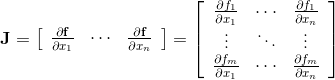

# AD-PYNE 

###### A(utomatic) D(ifferentiation) - (As developed by) P(aulina) Y(aowei) N(ikhil) E(mma)

Milestone 1

November 19, 2019

# Introduction

Differentiation's use is ubiquitous across the sciences and is required for common methods such as optimization. Historically, there have existed two ways of computing derivatives: symbolic differentiation and method of finite differences. Both of these techniques have numerous drawbacks. Symbolic differentiation involves manipulating the abstract formula using mathematical expressions and rules to produce a desired derivative formula. This can be computationally expensive, and it does not address derivatives which are impossible to compute by hand, and have no "closed-form" solution. The method of finite differences can solve these issues, but in turn it requires a good choice of step size for the derivative to be evaluated accurately and in a stable manner. 

Automatic differentiation (AD) is the best of worlds: it is not as computationally expensive, it can address functions whose derivatives are impossible to compute by hand, and it is stable and accurate to machine precision. 

# Background

Automatic differentiation teaches the computer how to calculate derivatives on its own without relying on computationally expensive symbolic differentiation programs or on potentially unstable and inaccurate approximations with the finite-difference method. AD breaks down the task of calculating a derivative of any function into a series of more simple elementary operations such as addition, multiplication, powers, natural log, etc., whose derivatives we already know. We piece together these derivatives using the Chain Rule.

### Chain Rule

This breakdown is made possible by the Chain Rule, where F(x) is a composition of two or more functions.


In automatic differentiation, we treat a function as the composition of all of its elementary operations. Thus, the derivative of the original function is the result of using the Chain Rule to combine the derivatives of its constituents.  

### Computational Graph

The computational graph of the function allows us to see and record the progress of the Chain Rule at each step of composition. 

**Example function:**


**Example computational graph:**


In the graph above, we can see the input term on the left side. We break the function into nodes, each representing an elementary function performed on previous nodes. The computational graph gives us a visual understanding of how the function is being built up and how we are applying the Chain Rule to form the final derivative.

### Trace Table

The computational graph visualizes the trace table where each elementary function performed gets its own row of current inputs, values, the derivative of the elementary function (as determined by previous steps) and the value of the derivative of the elementary function evaluated at the current value. 

**Example trace table:**

| Trace         | Elementary Function           | Elementary Function Derivative   | Current Value           | ∇x          |
| ------------- | ----------------------------- | -------------------------------- | ----------------------- | ----------- |
| x<sub>1</sub> | x<sub>1</sub>                 | ẋ<sub>1</sub>                    | x                       | 1           |
| x<sub>2</sub> | x<sub>1</sub><sup>2</sup>     | 2x<sub>2</sub>ẋ<sub>1</sub>      | 2x                      | 2x          |
| x<sub>3</sub> | 3x<sub>2</sub>                | 3ẋ<sub>2</sub>                   | 3x<sup>2</sup>          | 6x          |
| x<sub>4</sub> | sin(x<sub>1</sub>)            | cos(x<sub>1</sub>) ẋ<sub>1</sub> | sin(x)                  | cos(x)      |
| x<sub>5</sub> | x<sub>3</sub> + x<sub>4</sub> | ẋ<sub>3</sub> + ẋ<sub>4</sub>    | 3x<sup>2</sup> + sin(x) | 6x + cos(x) |

Automatic Differentiation moves forward through this graph (but does not necessarily have to record all the rows) to calculate the derivative of the full function. The value of the derivative ẋ<sub>1</sub> is determined by a seed vector: a vector of derivative values initialized for the variables of interest. 

### The Jacobian

The trace table above shows us how to manually perform the forward mode of automatic differentiation for scalar functions of a single variable; however, during practical application we will need to be able to handle systems of equations (*f* as a vector), which will require differentiation of a vector function of multiple variables. An important element of this process is the Jacobian matrix, which contains the function’s partial derivatives.



We know from above that automatic differentiation computes the derivative as the dot product of the gradient and the seed vector, written as:


 Considering the Jacobian form, what forward mode really computes is . Beyond this, we can choose the value of the seed vectors {*p*<sub>1</sub>, ..., *p*<sub>*n*</sub>} where *p*<sub>i</sub> ∈  ℝ<sup>*n*</sup> to form the entirety or part of the Jacobian, depending on our applications.

# How to Use AD-PYNE

For an interactive guide on how to use **AD-PYNE**, please see the Jupyter notebook **HowToGuide.ipynb** in `/docs`. 

## Importing

(Final Version)

```python
import numpy as np
from AD-PYNE.AutoDiff import AutoDiff
import AD-PYNE.elemFunctions
```

(Current Version / No package yet.)

```python
import numpy as np
from AutoDiff import AutoDiff
import elemFunctions as ef
```

## Calculating Derivatives using Forward Mode

### Derivatives of Scalar Functions of Scalars with Single Input

#### Instantiating an AutoDiff Object

If your goal is to build and find the derivatives of scalar functions of a single input, follow the template below for instantiating an `AutoDiff` object. 

```
x = AutoDiff(5, 2)
```

The first argument in the `AutoDiff` initialization function is the value of the function. The second argument in the `AutoDiff` initialization function is the derivative of the function. When first  instantiating an AutoDiff object, this derivative is the seed. (See the **Calculating the Jacobian** section below for more detail on picking a seed.)

Each `AutoDiff` object holds the value in `.val`, the derivative in `.der`, and the Jacobian in `.jacobian`. You can access these elements as shown below.

 **Warning:** All values are stored as numpy arrays. Scalar values are stored as 1 x 1 arrays. If you need to work with Python ints or floats, you must do the conversion yourself on the returned values. Do not  convert the stored elements in the objects themselves. 

```python
print("Value: ", x.val)
print("Derivative: ", x.der)
print("Jacobian: ", x.jacobian)
'''
OUTPUT
======
Value:  [[5]]
Derivative:  [[2.]]
Jacobian:  [[1.]]
'''
```

You can converting the returned elements to Python ints or floats for your own purposes.

```python
# Correct conversion
theValueF = float(x.val)
theDerivativeF = float(x.der)
theJacobianF = float(x.jacobian)

print("Value: ", theValueF)
print("Derivative: ", theDerivativeF)
print("Jacobian: ", theJacobianF)
'''
OUTPUT
======
Value:  5.0
Derivative:  2.0
Jacobian:  1.0
'''
```

 **Example of incorrect conversion:** 

```python
x.val = float(x.val) 
x.der = float(x.der) 
x.jacobian = float(x.jacobian) 
```

#### Calculating the Jacobian

You have two options for calculating the jacobian of a function. 

##### Option 1 - Using a Seed of 1

If you know that you only need the jacobian of function, you can simply initialize an `AutoDiff` object with a derivative (or seed) of 1. In this case, the derivative and jacobian of the function will be the same. 

```python
x = AutoDiff(5, 1)

print("Value: ", x.val)
print("Derivative: ", x.der)
print("Jacobian: ", x.jacobian)
'''
OUTPUT
======
Value:  [[5]]
Derivative:  [[1.]]
Jacobian:  [[1.]]
'''
```

##### Option 2 - Using any Seed

If you need to set the derivative of the initial `AutoDiff` object to some number other than 1, you can still find the jacobian at any time by accessing the element `.jacobian` of the `AutoDiff` object as shown in **Instantiating an AutoDiff Object**. 

#### Building Up a Function

You may build up a function with any combination of the following elementary functions. 

Some of these functions are available as part of the **AutoDiff** module and do not require importing the additional **elmeFunctions** module. This functions are as follows: addition, subtraction,  multiplication, division, power, absolute value, negation, and invert.

All other elmentary functions require importing the **elemFunctions** module. These functions are: (natural) exponential, (natural) log, log  base 10, square root, absolute value, sine, cosine, tangent, arc sine,  arc cosine, arc tangent, hyperbolic sine, hyperbolic cosine, hyperbolic  tangent, hyperbolic arc sine, hyperbolic arc cosine, and hyperbolic arc  tangent.

To build up the function, pass in the AutoDiff object into the  elemenary functions or manipulate the AutoDiff object using Python  operations. Store the function in a variable. 

##### Example 1

```python
x = AutoDiff(3, 2)
f = x**3 - 5*x**-2 + 2*x + 5
print("Value: ", f.val)
print("Derivative: ", f.der)
print("Jacobian: ", f.jacobian)
'''
Value:  [[37.44444444]]
Derivative:  [[58.74074074]]
Jacobian:  [[29.37037037]]
'''
```

In the example above, the AutoDiff object `x` is initialized with a value of 3 and a seed of 2 for its derivative. Each operation on `x` produces a new AutoDiff function. Any number of elementary functions  and operations can be done in a single line and stored in a single  AutoDiff function. 

##### Example 2

Building up the function piece by piece is also valid and will produce the same results. 

```python
x = AutoDiff(3, 2)
f = x**3
g = -5*x**-2
h = 2*x + 5
fgh = f + g + h
print("Value: ", fgh.val)
print("Derivative: ", fgh.der)
print("Jacobian: ", fgh.jacobian)
'''
OUTPUT
======
Value:  [[37.44444444]]
Derivative:  [[58.74074074]]
Jacobian:  [[29.37037037]]
'''
```

##### Example 3

Call and use the elmentary functions in the **elemFunctions** as you would any other function.

```python
x = AutoDiff(np.pi, 0.5, 1)

f = ef.sin(x) + ef.cos(x**2) + ef.tan(x)**ef.sqrt(x)

print("Value: ", f.val)
print("Derivative: ", f.der)
print("Jacobian: ", f.jacobian)

'''
OUTPUT
======
Value:  [[37.44444444]]
Derivative:  [[58.74074074]]
Jacobian:  [[29.37037037]]
'''
```

# Software Organization 

## Directory Structure 


	AD-PYNE/
	
	    AD-PYNE/
	
		__init__.py
	
		elemFunctions.py
	
		AutoDiff.py
	
		tests/
	
		    elemFunctions_tests.py
	
		    AutoDiff_tests.py
		    
		docs/
	
		    milestone1.md
	
		   	milestone2.md
		   	
		   	HowToGuide.ipynb
	
		README.md
	
		LICENSE
	
		setup.py
	
		requirements.txt


## Modules

###  elemFunctions

This module contains the hard-coded derivatives of the elementary functions such as sine, cosine, square root, log, exp, etc. Thus, we are creating our own custom elementary math functions using `numpy` math functions that can be performed on  `AutoDiff` objects, and will return ` AutoDiff` objects. Duck typing will also allow the user to pass in (vectors of) scalars and return (vectors of) scalars. It will import the `AutoDiff` class from the **AutoDiff** module.  Users must import this module separately from the **AutoDiff** module in order to use these additional elementary functions.

### AutoDiff

This module contains the `AutoDiff` class that calculates the derivative and Jacobian of a (currently only scalar) function at a given point and seed using the forward mode of automatic differentiation. The forward mode will automatically calculate the derivative and the Jacobian at each step of the function. The module overloads Python operations such as multiplication as well as some unary operations such as negation. (For a full list, see the **Forward Mode Implementation: Class** section below.)


## Test Suite

The test suite lives in the `tests/` folder. Each module has its own test suite. 

We will be using `TravisCI` to ensure that all tests pass.
We will be using `CodeCov` to ensure that all code is covered by a test. 


## Distribution

Distribution will be done through `PyPI` and `twine` will be used to upload the distribution package.


## Packaging 

Software packaging will be done without a framework and through Python's native distribution tools. Our target audience is a developer (or developer-student) audience. We are only packaging a library that will be used solely within Python by users who are assumed to know how to install and use Python packages. It is not a full fledged application like a web application nor is it its own executable software. The software organization is minimal and can be handled manually. 


# Forward Mode Implementation

Our forward mode implementation requires that the user pass in the following information when instantiating their `AutoDiff` objects:

* The scalar value or vector of values to be evaluated
* The scalar seed for the single value or a seed vector for the vector of values. This will be used to evaluate the derivative.
* The total number of inputs *n* that will be used in the final function(s)
* The index of the variable used in the`AutoDiff`. That is, the user will provide some value *k* that denotes that the `AutoDiff` refers to the *k*<sup>th</sup> input variable in a vector of 1 to *n* total variables.

The forward mode will automatically calculate the derivative and the Jacobian at each step of the function. 

## Core Data Structures

The core data structures are:

* `numpy` arrays: We will be treating all values and arguments as array. 
  * A single variable, integer, or float will be treated as a 1 x 1 `numpy` array. This is done so that we don't have to deal with single values separately from vectors. 
  * Lists will be converted to 1 x n `numpy` arrays.
  * Users will not be allowed to pass in dictionaries to set their values. The evaluated output and derivative of the `AutoDiff` object will stored in their respective attributes and not in a general `params` attribute that holds a dictionary in the form `{'val': [], 'der': [] }`.

## Classes: Methods, and Name Attributes 

### AutoDiff

* Methods
  * `_convertNonArray` is a helper function that converts passed in scalar values to `numpy` arrays. This function is "private" and never needs to be called by the user. 
  * `_calcJacobian` is a helper function that calculates the Jacobian of the `AutoDiff` object when it is first instantiated by the user. It considers how many multiple inputs will ultimately be used in the final function(s) and the specific input of the `AutoDiff` object. This function is "private" and never needs to be called by the user. 
    * **Example:** The user wants to build a function with two different inputs, `x` and `y`. The user will create an `AutoDiff` object for `x` by passing in the total number of inputs as `2` and pass in `1` as the "index" for `x`. `_calcJacobian`wil then create the Jacobian treating `x` as the first partial derivative. 
  * Overloaded Python operations:
    * `__add__`
    * `__radd__`
    * `__sub__`
    * `__rsub__`
    * `__mul__`
    * `__rmul__`
    * `__truediv__`
    * `__rtruediv__`
    * `__pow__`
    * `__rpow__`
    * `__pos__`
    * `__neg__`
    * `__abs__`
    * `__invert__`
* Attributes
  * `val` is the value of the function.
  * `der`is the value of the derivative of the function.
  * `jacobian` is the Jacobian of the partial derivatives
  * `n` is the total number of inputs to be used in the final function(s)
  * `k`denotes that the `AutoDiff` object refers to the *k*<sup>th</sup> input variable in a vector of 1 to *n* variables
  
  

## To Be Implemented

Currently, our forward mode has limited ability to accept vector functions and vector inputs. Our goal is to make our package compatible for the following cases:

- Scalar functions with single input of vectors
- Scalar functions with multiple inputs of scalars
- Scalar functions with multiple inputs of vectors
- Vector function with single input of a scalar
- Vector functions with single inputs of vectors
- Vector functions with multiple inputs of scalars
- Vector functions with multiple inputs of vectors

This will involve editing the `AutoDiff` and `elemFunctions` modules, potentially adding new helper functions . 

As of now, we have a framework for instantiating `AutoDiff` objects with a single input of vectors.

We also have a framework for instantiating `AutoDiff` objects ready to work for multiple inputs by asking the user to explicitly define:

- The total number of inputs to be ultimately used in the final function
- The index (starting at 1) of the input attached to the instantiated `AutoDiff` object

The **How-To Guide** will be crucial in getting users to understand how to work with cases beyond scalar functions with single, scalar inputs. 

Additionally, our test suite will be changed to assess our forward mode’s ability to handle the above cases.


## External Dependencies

### numpy

`numpy` will be used to handle vector operations and math functions such as `sqrt`. 

### pytest

`pytest` will be used to handle tests.  


## Elementary Functions

Native Python elementary functions such as addition, multiplication, and power will be dealt with by overloading the operations in the `AutoDiff.py` operations. 

Elementary functions not native to Python will be dealt with in a specific module called `elemFunctions.py` which will hold Python functions that return the hard-coded derivative the elementary function. Functions will include many of those defined in `numpy`:

* `sin`
* `cos`
* `tan`
* `arcsin`
* `arccos`
* `arctan`
* `sinh`
* `cosh`
* `tanh`
* `arcsinh`
* `arccosh`
* `arctanh`
* `sqrt`
* `exp`
* `log`
* `log10`

## Future Features: Dual Numbers

In addition to refining our forward mode to handle vectors, we plan on creating an alternative method of automatic differentiation with dual numbers. 

### Dual Number Module

Because dual numbers rely on substitution, Taylor series, and simplification rather than explicit derivatives or the chain rule as our current forward mode does, this method will require creating a module separate from the **AutoDiff.py** module. 

Within this module, we will define an `AD_Dual` object, containing a real and dual part, that will function much in the same way as the` AutoDiff` object. When the user inputs the `AD_Dual` object into a function, the resulting object will have the evaluated value of the function as its real part and the evaluated value of the derivative as its dual part. 

### Additional Work

For this implementation, we will need additional documentation explaining how dual numbers calculations work in general, and how to use the dual numbers mode compared to our main forward mode. The dual numbers mode may also require new dependencies in order to handle Taylor series substitutions necessary for the calculations. We will attempt to make this mode vector-friendly as well. Lastly, it will be useful to specify how the dual numbers mode compares to the forward mode and what are the advantages and disadvantages of each method.
